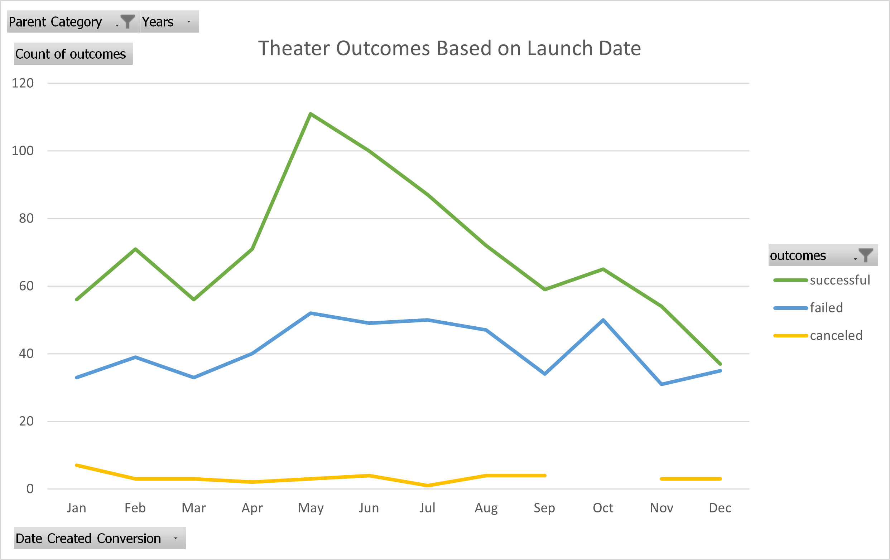
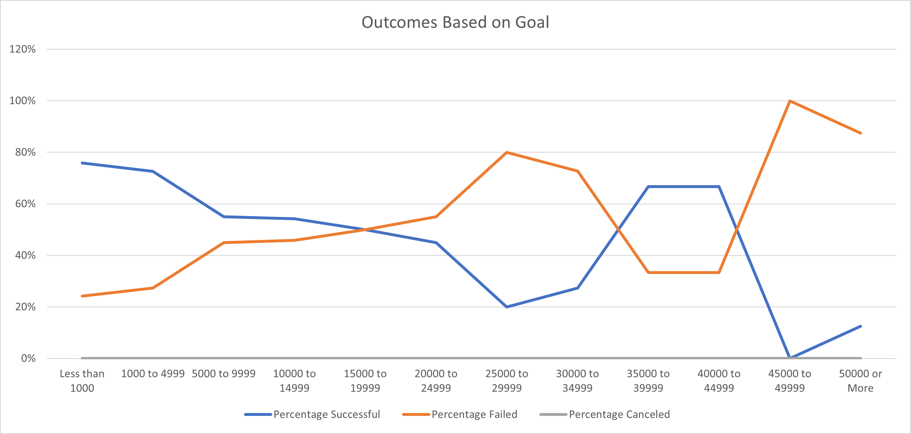

# **Kickstarting with Excel**

## Overview of Project

This project analyzes Kickstarter data to uncover trends in campaign strategies. It organizes, sorts, and filters the data set to focus on Theater Campaigns, specifically the "plays" subcategory. The project continues by narrowing in on two main strategic factors: campaign launch dates and campaign funding goals.  

### Purpose

The purpose of this project is to assist the client, Louise, as she embarks on her journey to launch a Kickstarter campaign for her play, "Fever", which she estimates should have a budget of about $10,000. My goal was to use existing crowdfunding data from Kickstarter to hone in on a few possible winning strategies that Louise can mirror in her own Kickstarter campaign to secure the best possible outcome for her play.

## Analysis and Challenges

### Analysis of Outcomes Based on Launch Date

The catagorical data for the type of campaign was separated into parent categories and their subcategories.

Data was then sorted into pivot tables that narrowed in on how different campaigns fared in relation to their launch date as the client, Louise requested.

I created the first pivot table sorting Kickstarter data by three of the four potential Outcomes, "successful," "failed," and "canceled," while filtering for the "Theater" parent category and "Years." This table may be found on the sheet titled "Theater Outcomes by Launch Date". 

In the creation of our first pivot table, we could immediatly see significant numbers of successful campaigns were launched in May and June for all of the years recorded in the data set. 

While a greater number of campaigns overall were also launched in these two months, looking at a line graph shows a large gap between the "successful" campaigns line and the lines for "failed" or "canceled" campaigns. This could be demonstrative of a possible trend in success for campaigns launched in May and June. 

     

This did not take into account differences in campaign goals. Were these Theater campaigns more or less successful depending on the dollar amounts of their fundraising goals? 

### Analysis of Outcomes Based on Goals

Using the =countifs() function in Excel, I took a deeper look into how campaigns faired by their funding goals in dollars. We separated the funding goals into 12 dollar amount ranges: Less than 1000, 1000 to 4999, 5000 to 9999, 10000 to 14999, 15000 to 19999, 20000 to 24999, 25000 to 29999, 30000 to 34999, 35000 to 39999, 40000 to 44999, 45000 to 49999, and 50000 or More.  

This data is also specifically filtered to only show the outcomes for the subcategory of "plays."  In doing so, I realized that there were zero canceled Kickstarter campaigns for plays.  This can be represented by the flat grey line on the X axis of the graph.  

The number of "successful," "failed," and "canceled," Kickstarter campaigns for plays were converted into their respective percentage rates against the total number of campaigns kickstarted with the campaigns goals by dollar amount.  The graph below shows the outcomes by their percentage of total campaigns for each goal dollar amount range. The graph looks a bit like a reach and grab tool.  It seems to lack significant predictability in the center of the data with the strongest points at the beggining and ends of the line graph.

### Challenges and Difficulties Encountered

- The first challenge in analyzing this data set was in converting date related data from Unix Timestamps to the easier to analyze Human (Month, Day, Year) format. This was solved with a simple conversion function. 

## Results

### Conclusions from Theater Outcomes By Launch Date

- Looking at Outcomes based on Launch Date, I feel confident concluding that May is the best month to launch a Kickstarter campaign. 
- We can also conclude that December had the least number of successful Theater campaigns. I would discourage launching a campaign in the month of December.

### Conclusions from Outcomes based on Goals
 - While the middle of the goal data set seems to be a bit more volitile, there is a significant drop in the success rates for Kickstarter campaigns hoping to raise $45,000 or more. The most successful Kickstarter campaigns seem to have more modest goals of less than $5,000.  

### Limitations

- This data set is mainly limited to quantifiable data and relatively simple booleans and categories.  It is unable to discuss or compare more detailed information about marketing strategies of the campaigns. For example, how did campaigners get the word out to contributors about their Kickstarter campaigns?  This is probably difficult to quantify but can make a big impact on the success of a campaign. Did a celebrity share the Kickstarter to their social media? How many facebook/Instagram/Twitter followers did each capmpaign starter have? Is the campaign run by individuals who already have strong connections with potential contributors? 

- Another consideration going forward in all data analyses will be in how does the data compare or is it relevant in a Post 2020/Covid 19/Pandemic world? The data set we were working with here is from 2009 to 2017.  How might the data differ for Kickstarter campaigns from 2020 to present? What challenges might Louise find in starting a Kickstarter campaign for her play in the present post-pandemic global economic situation that cannot be predicted by this older data set?

### Some additional tables and graphs to potentially be created:

 --Play Outcomes by Luanch Date analyzing any potential stronger trends specifically for plays  
 
 --Total Campaign Time Lengths vs. Outcomes Based on Launch Date analyzing if there might be a trend in shorter or longer time frames needed to reach campaign goals depending on what months of the year they are launched and by the dollar amounts of their campaign goals. 

 --We might also re-evaluate all of the above charts filtering for only Kickstarter campaigns in the US.  If the client intends on Kickstarting a campaign in the US, filtering the data as such would seem most relevant.
 
 --Perhaps I could make a Box and Whisker plot to find any potential outliers in campaign goals and pledged amounts in dollars.  This would tell me if there are any unique circumstances that may not be relevant to my client's goals.
